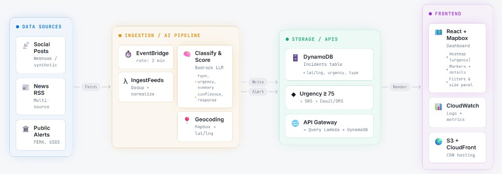

# CrisisPulse — Real-Time Disaster Response AI Map

CrisisPulse is a full-stack application that ingests disaster reports from multiple sources, classifies them using AI, and plots them on an interactive global heatmap with urgency scoring, explainability, and resource allocation recommendations.

## What It Does

- **Ingests** disaster reports from RSS feeds (GDACS, ReliefWeb) and a synthetic social media dataset stored in S3
- **Classifies** each report using Amazon Bedrock (Claude) to extract disaster type, urgency score (0–100), location, summary, confidence, recommended response, and a rationale explaining *why* it assigned that urgency
- **Geocodes** extracted locations into lat/lng coordinates via the Mapbox Geocoding API
- **Stores** enriched incidents in DynamoDB with automatic TTL expiration
- **Alerts** on critical incidents (urgency >= 75) by publishing to an SNS topic (email/SMS)
- **Displays** everything on a real-time interactive map with heatmap visualization, marker clustering, filtering, and detail panels

## Architecture



Data sources (social posts, RSS feeds, public alerts) flow through the ingestion/AI pipeline (EventBridge → Lambda → Bedrock classification → Mapbox geocoding), into storage (DynamoDB + SNS alerts), and out to the React + Mapbox frontend via API Gateway.

## Data Flow

1. **EventBridge** triggers the `IngestAndClassify` Lambda every 2 minutes
2. Lambda pulls a batch of posts from S3 (synthetic dataset) and/or RSS feeds
3. Each post is sent to **Amazon Bedrock** (Claude 3 Haiku) which returns structured JSON: disaster type, urgency score, summary, confidence, recommended response, and urgency rationale
4. The extracted location text is forward-geocoded via the **Mapbox Geocoding API** to get precise lat/lng coordinates
5. The fully enriched incident is written to **DynamoDB**
6. If urgency >= 75 (critical), an alert is published to **SNS** (email/SMS)
7. The **React frontend** polls the API every 30 seconds, fetching only new incidents since the last timestamp, and merges them into the map in real time

## Tech Stack

### Frontend
- **React 18** + **TypeScript** — UI framework
- **Vite** — build tooling and dev server
- **Mapbox GL JS** — interactive map with dark theme, heatmap layer, marker clustering, and popups

### Backend
- **AWS Lambda** (Node.js 20.x) — serverless compute for ingestion/classification and API
- **Amazon Bedrock** (Claude 3 Haiku) — AI classification with structured JSON output
- **Amazon DynamoDB** — NoSQL storage with TTL for automatic incident expiration
- **Amazon SNS** — push notifications for critical incidents
- **Amazon S3** — stores the synthetic dataset
- **Amazon EventBridge** — scheduled triggers for the ingestion pipeline
- **AWS API Gateway** — REST API with CORS for frontend access
- **Mapbox Geocoding API** — forward geocoding of location text to coordinates

## Project Structure

```
CrisisPulse/
├── frontend/
│   └── src/
│       ├── components/
│       │   ├── MapView.tsx          # Main map with heatmap, clusters, and click interactions
│       │   ├── FilterBar.tsx        # Top filter bar (time, type, urgency slider)
│       │   ├── IncidentPanel.tsx    # Right-side detail panel with urgency rationale
│       │   └── DemoToggle.tsx       # 1-click demo injector button
│       ├── services/
│       │   └── api.ts              # API client for fetching incidents and injecting demos
│       ├── types/
│       │   └── incident.ts         # TypeScript interfaces
│       ├── App.tsx
│       └── index.css
├── backend/
│   └── lambdas/
│       ├── IngestAndClassify/
│       │   └── index.mjs           # Pipeline: S3 → Bedrock → Mapbox → DynamoDB → SNS
│       └── GetIncidentsApi/
│           └── index.mjs           # REST API: query incidents + demo injector
├── data/
│   └── synthetic_posts.json        # 60 simulated disaster reports for demo
└── docs/
```

## Key Features

### AI Classification with Explainability
Each incident is classified by Bedrock with a structured prompt that forces JSON output containing disaster type, urgency score (0–100), and a **rationale** explaining why that score was assigned — citing specific signals like "M7.1 magnitude", "collapsed buildings", or "500,000 displaced".

### Urgency Scoring
| Score | Label | Description |
|-------|-------|-------------|
| 0–24 | Low | Minor incident, no immediate danger |
| 25–49 | Medium | Moderate, localized impact |
| 50–74 | High | Significant, large-scale impact |
| 75–100 | Critical | Catastrophic, mass casualties likely → triggers SNS alert |

### Interactive Map Layers
- **Heatmap** — severity-weighted density visualization at low zoom
- **Cluster circles** — aggregate nearby incidents with color based on average urgency
- **Individual markers** — color-coded by urgency label at high zoom
- **Cluster popups** — show incident count, type breakdown, and resource recommendations
- **Detail panel** — full incident info with urgency meter, rationale, and recommended response

### Cluster-Level Resource Recommendations
When clicking a cluster, the system analyzes the dominant disaster type and recommends appropriate resources:

| Dominant Type | Recommended Resources |
|--------------|----------------------|
| Flood | Water purification, Boat rescues, Sanitation kits |
| Earthquake | Search & rescue teams, Medical aid, Structural engineers |
| Fire | Evacuation transport, Air tankers, Burn medical kits |
| Storm | Emergency shelter, Power generators, Debris clearance |

### Real-Time Updates
- Frontend polls every 30 seconds using incremental `since=lastTimestamp` queries
- New incidents merge into existing state without full reload
- Filter changes trigger immediate re-fetch

### 1-Click Demo Mode
A hidden "Demo" button injects 10 pre-classified global incidents instantly — no Bedrock calls needed — so the heatmap lights up immediately for presentations.

## Environment Variables

### Lambda: IngestAndClassify
| Variable | Description |
|----------|-------------|
| `TABLE_NAME` | DynamoDB table name |
| `SNS_TOPIC_ARN` | SNS topic ARN for critical alerts |
| `MAPBOX_TOKEN` | Mapbox API token for geocoding |
| `BEDROCK_MODEL_ID` | Bedrock model ID (e.g. `anthropic.claude-3-haiku-20240307-v1:0`) |
| `DATA_BUCKET` | S3 bucket containing synthetic data |
| `DATA_KEY` | S3 object key (e.g. `synthetic_posts.json`) |

### Lambda: GetIncidentsApi
| Variable | Description |
|----------|-------------|
| `TABLE_NAME` | DynamoDB table name |

### Frontend (.env)
| Variable | Description |
|----------|-------------|
| `VITE_MAPBOX_TOKEN` | Mapbox public token for the map |
| `VITE_API_BASE` | API Gateway invoke URL (e.g. `https://xxx.execute-api.us-east-1.amazonaws.com/prod`) |

## Getting Started

### Prerequisites
- AWS account with access to Bedrock (Claude model enabled), DynamoDB, Lambda, API Gateway, S3, SNS, EventBridge
- Mapbox account (free tier — 100K geocoding requests/month)
- Node.js 18+

### Frontend
```bash
cd frontend
npm install
# Edit .env with your Mapbox token and API Gateway URL
npm run dev
```

### Backend
Deploy each Lambda via the AWS Console:
1. Create `CrisisPulse-IngestAndClassify` (Node.js 20.x) — paste `backend/lambdas/IngestAndClassify/index.mjs`
2. Create `CrisisPulse-GetIncidentsApi` (Node.js 20.x) — paste `backend/lambdas/GetIncidentsApi/index.mjs`
3. Set environment variables on each Lambda
4. Create API Gateway REST API with `/incidents` (GET) and `/inject-demo` (POST) routes
5. Create EventBridge rule to trigger IngestAndClassify every 2 minutes
6. Create SNS topic and subscribe your email

## License

MIT
